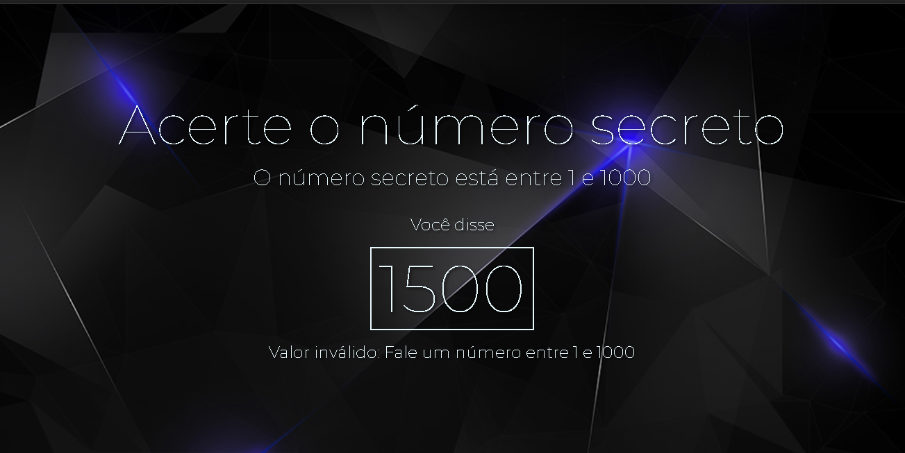

## Jogo da Adivinhação por Voz 🎤
Este é um jogo web simples onde você precisa adivinhar um número secreto usando comandos de voz!

## Como Jogar?
- Inicie o jogo: Abra o arquivo index.html no seu navegador.
- Permita o acesso ao microfone: O jogo solicitará permissão para usar seu microfone.    Conceda a permissão para que o jogo possa ouvir seus palpites. 
- Fale o seu palpite: Assim que o jogo iniciar, ele irá gerar um número secreto entre 1 e 1000. Diga um número em voz alta para dar o seu palpite.
- Receba dicas: O jogo irá te dizer se o número secreto é maior ou menor do que o seu palpite.
- Continue tentando: Use as dicas para refinar seus palpites até adivinhar o número secreto!

## Tecnologias Utilizadas:

